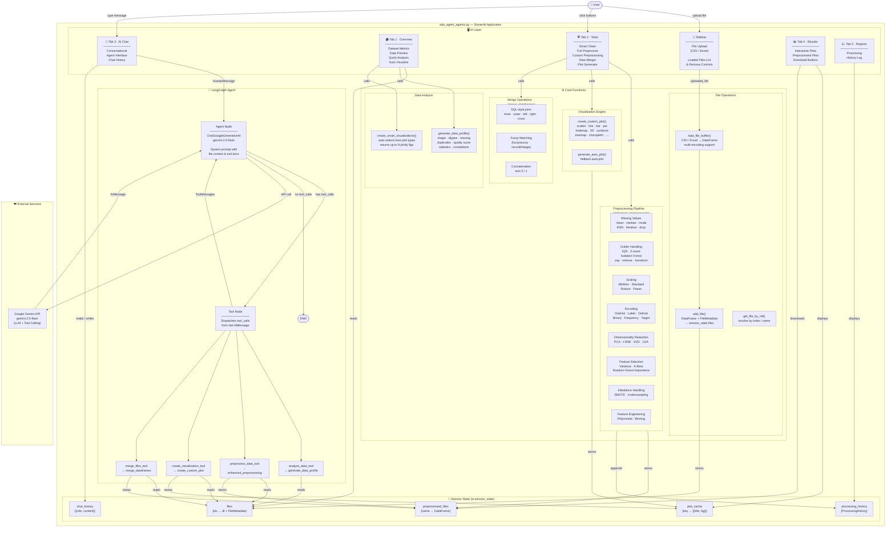

# 🏗️ Architecture Diagram — Streamlit Version

> This document describes the architecture of the **Streamlit-based** Conversational EDA Agent (`eda_agent_agentic.py`).

---

## Overview



---

## Component Breakdown

| Layer | Component | Description |
|-------|-----------|-------------|
| **UI** | Sidebar | CSV/Excel file upload; lists loaded files with remove controls |
| **UI** | Tab 1 — Overview | Summary metrics (rows/cols/size), per-file data preview, quick analysis and auto-visualize buttons |
| **UI** | Tab 2 — Tools | One-click Quick Actions; advanced Custom Preprocessing form; Data Merger; Plot Generator |
| **UI** | Tab 3 — AI Chat | Full conversational interface backed by the LangGraph agent |
| **UI** | Tab 4 — Results | Renders cached interactive plots; lists downloadable preprocessed files |
| **UI** | Tab 5 — Reports | Shows the ordered processing history log |
| **State** | `files` | Dict mapping int ID → `{df: DataFrame, metadata: FileMetadata}` |
| **State** | `preprocessed_files` | Dict mapping filename → processed DataFrame |
| **State** | `processing_history` | List of `ProcessingHistory` dataclasses (action, params, timestamp, shape, status) |
| **State** | `chat_history` | List of `{role, content}` dicts for chat display |
| **State** | `plot_cache` | Dict mapping cache key → list of `(title, figure)` tuples |
| **Core** | File Operations | `load_file_buffer` (multi-encoding CSV/XLSX), `add_file`, `get_file_by_ref` |
| **Core** | Data Analysis | `generate_data_profile` (quality score, stats, correlations), `create_smart_visualizations` |
| **Core** | Preprocessing | `enhanced_preprocessing` — 8-stage pipeline (see below) |
| **Core** | Visualization | `create_custom_plot` (30+ chart types via Plotly/Seaborn), `generate_auto_plot` |
| **Core** | Merge | `merge_dataframes` — SQL joins, concat, and fuzzy matching via fuzzywuzzy/recordlinkage |
| **Agent** | Agent Node | `ChatGoogleGenerativeAI` (Gemini 2.5 Flash) with system prompt carrying file context |
| **Agent** | Tool Node | Executes `tool_calls` from the last `AIMessage`, returns `ToolMessage` results |
| **Agent** | Tools | `analyze_data_tool`, `preprocess_data_tool`, `create_visualization_tool`, `merge_files_tool` |
| **External** | Google Gemini API | LLM backend for reasoning and tool-call generation |

---

## Preprocessing Pipeline Stages

```
enhanced_preprocessing(df, params)
  │
  ├─ 1. Missing Values      → mean / median / mode / KNN / Iterative / drop
  ├─ 2. Outlier Handling    → IQR / Z-score / Isolation Forest  →  cap / remove / transform
  ├─ 3. Scaling             → MinMax / Standard / Robust / Power (Yeo-Johnson / Box-Cox)
  ├─ 4. Encoding            → OneHot / Label / Ordinal / Binary / Frequency / Target
  ├─ 5. Dim. Reduction      → PCA / t-SNE / TruncatedSVD / LDA
  ├─ 6. Feature Selection   → Variance threshold / SelectKBest / Random Forest importance
  ├─ 7. Imbalance Handling  → SMOTE (oversampling) / Random Undersampling
  └─ 8. Feature Engineering → Polynomial features / Column binning
```

---

## LangGraph Agent Flow

```
User message
    │
    ▼
[Agent Node] ── system prompt + available tools ──► Google Gemini API
    │                                                       │
    │◄──────────────── AIMessage (± tool_calls) ────────────┘
    │
    ├── No tool_calls ──► END  (reply shown to user)
    │
    └── Has tool_calls
            │
            ▼
       [Tool Node]
            │
            ├── analyze_data_tool     → generate_data_profile
            ├── preprocess_data_tool  → enhanced_preprocessing
            ├── create_visualization_tool → create_custom_plot
            └── merge_files_tool      → merge_dataframes
            │
            ▼
       ToolMessage results
            │
            ▼
       [Agent Node]  ← loop back for summary reply
```

---

## Key Libraries

| Purpose | Library |
|---------|---------|
| Web UI | `streamlit` |
| Data wrangling | `pandas`, `numpy` |
| Preprocessing & ML | `scikit-learn`, `imbalanced-learn` |
| Statistics | `scipy` |
| Visualization | `plotly`, `matplotlib`, `seaborn` |
| Fuzzy matching | `fuzzywuzzy`, `recordlinkage` |
| LLM / Agent | `langchain-google-genai`, `langgraph`, `langchain-core` |
| LLM backend | Google Gemini API (`google-generativeai`) |
