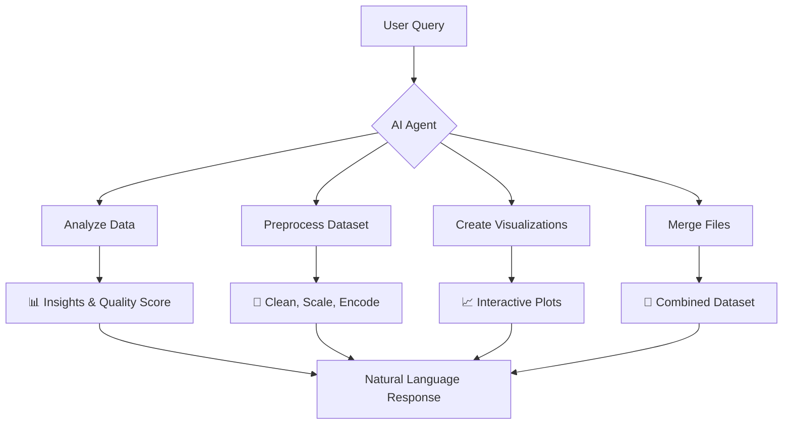

# 🤖 Conversational EDA Agent
### *The Future of Data Analysis is Here - Chat Your Way to Insights*

<div align="center">


<!-- 3D Rotating Data Visualization Animation -->


*Transform raw data into actionable insights through natural conversation*

</div>

---


https://github.com/user-attachments/assets/376f9547-1458-4214-bd2c-17f02afd3545


### 🎪 **Live Demo Scenarios**

<table>
<tr>
<td width="33%">

**🔍 Natural Analysis**
```
💬 "What patterns do you see 
    in my sales data?"

✨ Gets instant insights:
   • Revenue trends
   • Customer segments  
   • Seasonal patterns
   • Anomaly detection
```

</td>
<td width="33%">

**🛠️ Smart Preprocessing**
```
💬 "Fill missing values with 
    mean and remove outliers"

✨ Auto-executes:
   • Missing data handling
   • Outlier detection
   • Data scaling  
   • Feature encoding
```

</td>
<td width="33%">

**📊 Instant Visualizations**
```
💬 "Create a 3D scatter plot 
    of age vs income vs score"

✨ Generates:
   • Interactive 3D plots
   • Correlation heatmaps
   • Distribution analysis
   • Custom dashboards
```

</td>
</tr>
</table>

---

## 🧠 **Core Capabilities**

### 🎯 **Autonomous AI Agent**



### 🔧 **Advanced Preprocessing Pipeline**

<details>
<summary><strong>🛡️ Data Cleaning & Quality</strong></summary>

```python
✨ Missing Value Strategies:
   • Mean/Median/Mode imputation
   • KNN-based imputation  
   • Iterative imputation
   • Smart deletion

🎯 Outlier Detection:
   • IQR method
   • Z-score analysis
   • Isolation Forest
   • Statistical transformations

📊 Data Quality Scoring:
   • Completeness analysis
   • Consistency checks
   • Accuracy assessment
   • Reliability metrics
```

</details>

<details>
<summary><strong>⚙️ Feature Engineering</strong></summary>

```python
🔄 Scaling & Normalization:
   • MinMax scaling
   • Standard scaling
   • Robust scaling
   • Power transformations

🏷️ Encoding Strategies:
   • One-hot encoding
   • Ordinal encoding
   • Binary encoding
   • Target encoding

🎨 Advanced Features:
   • Polynomial features
   • Feature binning
   • Dimensionality reduction (PCA, t-SNE)
   • Feature selection
```

</details>

<details>
<summary><strong>🎭 ML-Ready Processing</strong></summary>

```python
⚖️ Imbalance Handling:
   • SMOTE oversampling
   • Random undersampling
   • Hybrid approaches

🔍 Feature Selection:
   • Variance thresholding
   • Statistical selection
   • Recursive elimination

🎯 Pipeline Ready:
   • Scikit-learn compatibility
   • Custom transformers
   • Automated workflows
```

</details>

### 📊 **Rich Visualization Suite**

<div align="center">

<!-- Visualization Types Animation -->


</div>

## 🚀 **Getting Started**

### ⚡ **Quick Launch**

```bash
# 1. Clone the repository
git clone https://github.com/tharunkumarvk/Conversational-Eda-Agent.git
cd Conversational-Eda-Agent

# 2. Install dependencies
pip install -r requirements.txt

# 3. Set up your API key
echo "GOOGLE_API_KEY=your_gemini_api_key_here" > .env

# 4. Launch the application
streamlit run eda_agent_agentic.py
```

## 📄 **License**

<div align="center">

This project is licensed under the **MIT License** - see the [LICENSE](LICENSE) file for details.

[](https://opensource.org/licenses/MIT)


