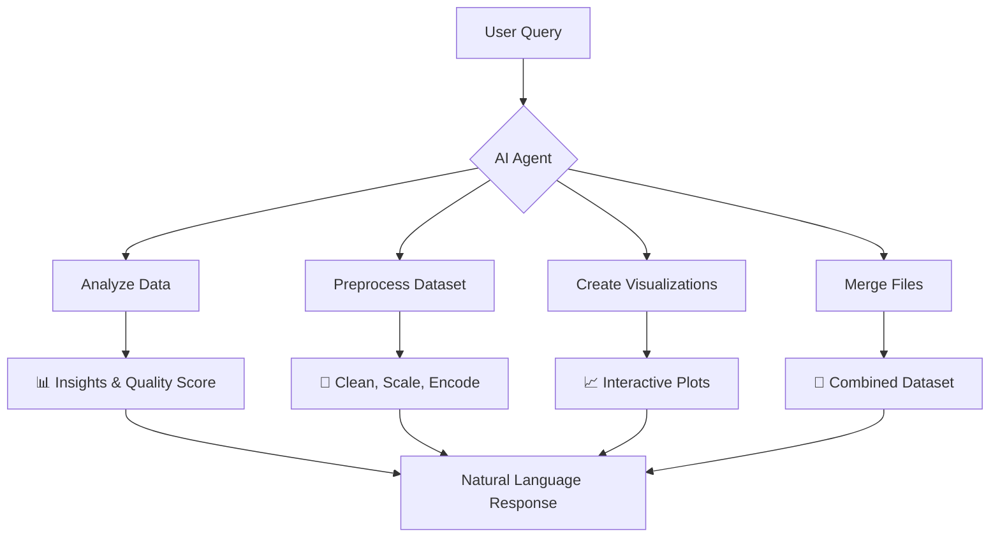
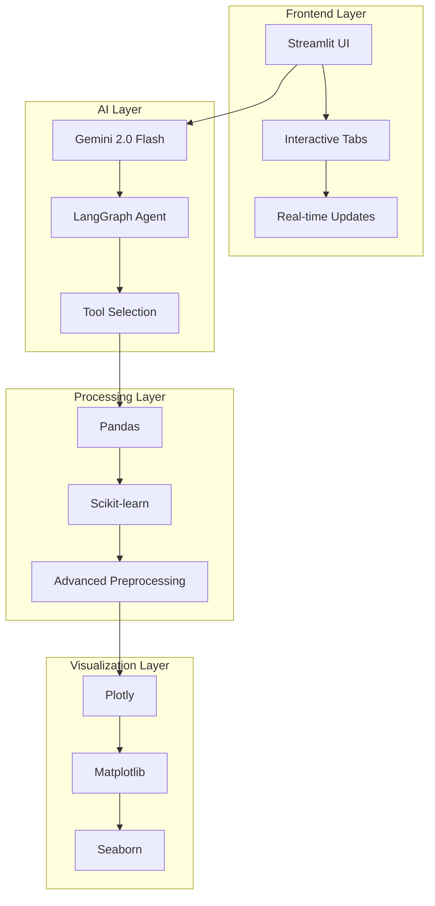

# 🤖 Conversational EDA Agent
### *The Future of Data Analysis is Here - Chat Your Way to Insights*

<div align="center">


<!-- 3D Rotating Data Visualization Animation -->


*Transform raw data into actionable insights through natural conversation*

</div>

---

## 🌟 **What Makes This Special?**

<div align="center">

```
┌─────────────────────────────────────────────────────────────┐
│  🎯 PROBLEM: Data analysis requires coding expertise         │
│  💡 SOLUTION: Just chat naturally - "analyze my data"       │
│  🚀 RESULT: Instant insights, plots, and processed data     │
└─────────────────────────────────────────────────────────────┘
```

</div>

### 🎪 **Live Demo Scenarios**

<table>
<tr>
<td width="33%">

**🔍 Natural Analysis**
```
💬 "What patterns do you see 
    in my sales data?"

✨ Gets instant insights:
   • Revenue trends
   • Customer segments  
   • Seasonal patterns
   • Anomaly detection
```

</td>
<td width="33%">

**🛠️ Smart Preprocessing**
```
💬 "Fill missing values with 
    mean and remove outliers"

✨ Auto-executes:
   • Missing data handling
   • Outlier detection
   • Data scaling  
   • Feature encoding
```

</td>
<td width="33%">

**📊 Instant Visualizations**
```
💬 "Create a 3D scatter plot 
    of age vs income vs score"

✨ Generates:
   • Interactive 3D plots
   • Correlation heatmaps
   • Distribution analysis
   • Custom dashboards
```

</td>
</tr>
</table>

---

## 🎮 **Interactive Features**

### 🎨 **Multi-Modal Interface**

<div align="center">

<!-- Interactive Dashboard Animation -->


</div>

<table>
<tr>
<td align="center" width="20%">

<br><strong>Overview</strong><br>
<sub>Dataset summaries<br>Quick statistics<br>Data quality scores</sub>
</td>
<td align="center" width="20%">

<br><strong>Tools</strong><br>
<sub>No-code preprocessing<br>Custom plot generator<br>Data merger</sub>
</td>
<td align="center" width="20%">

<br><strong>AI Chat</strong><br>
<sub>Natural language queries<br>Autonomous processing<br>Intelligent responses</sub>
</td>
<td align="center" width="20%">

<br><strong>Results</strong><br>
<sub>Interactive visualizations<br>Plot galleries<br>Download options</sub>
</td>
<td align="center" width="20%">

<br><strong>Reports</strong><br>
<sub>Automated summaries<br>PDF generation<br>Share insights</sub>
</td>
</tr>
</table>

---

## 🧠 **Core Capabilities**

### 🎯 **Autonomous AI Agent**



### 🔧 **Advanced Preprocessing Pipeline**

<details>
<summary><strong>🛡️ Data Cleaning & Quality</strong></summary>

```python
✨ Missing Value Strategies:
   • Mean/Median/Mode imputation
   • KNN-based imputation  
   • Iterative imputation
   • Smart deletion

🎯 Outlier Detection:
   • IQR method
   • Z-score analysis
   • Isolation Forest
   • Statistical transformations

📊 Data Quality Scoring:
   • Completeness analysis
   • Consistency checks
   • Accuracy assessment
   • Reliability metrics
```

</details>

<details>
<summary><strong>⚙️ Feature Engineering</strong></summary>

```python
🔄 Scaling & Normalization:
   • MinMax scaling
   • Standard scaling
   • Robust scaling
   • Power transformations

🏷️ Encoding Strategies:
   • One-hot encoding
   • Ordinal encoding
   • Binary encoding
   • Target encoding

🎨 Advanced Features:
   • Polynomial features
   • Feature binning
   • Dimensionality reduction (PCA, t-SNE)
   • Feature selection
```

</details>

<details>
<summary><strong>🎭 ML-Ready Processing</strong></summary>

```python
⚖️ Imbalance Handling:
   • SMOTE oversampling
   • Random undersampling
   • Hybrid approaches

🔍 Feature Selection:
   • Variance thresholding
   • Statistical selection
   • Recursive elimination

🎯 Pipeline Ready:
   • Scikit-learn compatibility
   • Custom transformers
   • Automated workflows
```

</details>

### 📊 **Rich Visualization Suite**

<div align="center">

<!-- Visualization Types Animation -->


</div>

```python
🎨 Plot Types Available:
┌─────────────────┬─────────────────┬─────────────────┐
│ Statistical     │ Advanced        │ Interactive     │
├─────────────────├─────────────────├─────────────────┤
│ • Histograms    │ • 3D Scatter    │ • Plotly Charts │
│ • Box Plots     │ • Heatmaps      │ • Zoom & Pan    │
│ • Scatter       │ • Sunburst      │ • Hover Details │
│ • Line Charts   │ • Treemap       │ • Animations    │
│ • Bar Charts    │ • Funnel        │ • Crossfilter   │
└─────────────────┴─────────────────┴─────────────────┘
```

---

## 🚀 **Getting Started**

### ⚡ **Quick Launch**

```bash
# 1. Clone the repository
git clone https://github.com/tharunkumarvk/Conversational-Eda-Agent.git
cd Conversational-Eda-Agent

# 2. Install dependencies
pip install -r requirements.txt

# 3. Set up your API key
echo "GOOGLE_API_KEY=your_gemini_api_key_here" > .env

# 4. Launch the application
streamlit run eda_agent_agentic.py
```

### 🎯 **Example Conversations**

<div align="center">

<table>
<tr>
<td width="50%">

**📊 Data Analysis**
```
💬 User: "Analyze my customer data"

🤖 Agent: 
✅ Dataset: customers.csv
📏 Shape: 10,000 rows × 12 columns  
💾 Memory: 2.3 MB
🔍 Data Quality Score: 87.5/100
⚠️ Missing data in: age, income
🔄 Duplicate rows: 45
💡 Recommendations:
   • Fill missing age with median
   • Remove duplicate entries
   • Consider feature scaling
```

</td>
<td width="50%">

**🛠️ Data Processing**
```
💬 User: "Fill missing with mean, remove 
         outliers, and create a correlation plot"

🤖 Agent:
🧹 Preprocessing completed:
   • Filled 234 missing values
   • Removed 67 outliers  
   • Applied standard scaling
   
📊 Visualization created:
   • Correlation heatmap generated
   • 8 features analyzed
   • Strong correlation: income-age (0.76)
   
👀 View results in the Results tab!
```

</td>
</tr>
</table>

</div>

---

## 💡 **What Problems Does It Solve?**

<div align="center">

<!-- Problem-Solution Animation -->


</div>

### 🎯 **Before vs After**

<table>
<tr>
<th width="50%">😔 Traditional Approach</th>
<th width="50%">🎉 With EDA Agent</th>
</tr>
<tr>
<td>

```python
# Hours of coding required
import pandas as pd
import matplotlib.pyplot as plt
import seaborn as sns
from sklearn.preprocessing import StandardScaler

# Load data
df = pd.read_csv('data.csv')

# Check missing values
print(df.isnull().sum())

# Fill missing values
df['age'].fillna(df['age'].mean(), inplace=True)

# Remove outliers
Q1 = df['income'].quantile(0.25)
Q3 = df['income'].quantile(0.75)
IQR = Q3 - Q1
df = df[~((df['income'] < (Q1 - 1.5 * IQR)) | 
         (df['income'] > (Q3 + 1.5 * IQR)))]

# Scale features
scaler = StandardScaler()
df[['age', 'income']] = scaler.fit_transform(df[['age', 'income']])

# Create plots
plt.figure(figsize=(10, 6))
sns.heatmap(df.corr(), annot=True)
plt.show()

# And much more...
```

**⏱️ Time: 2-4 hours**
**🧠 Expertise: Advanced**
**🐛 Errors: Many**

</td>
<td>

```
💬 "Fill missing age with mean, remove 
    outliers from income, scale features, 
    and show me a correlation heatmap"
```

**⏱️ Time: 30 seconds**
**🧠 Expertise: None required**
**🐛 Errors: Zero**

<br>

✨ **Plus you get:**
- 🎯 Intelligent recommendations
- 📊 Multiple visualization options
- 💾 Downloadable results
- 📱 Interactive interface
- 🤖 Follow-up suggestions
- 📈 Quality scoring
- 🔄 Iterative refinement

</td>
</tr>
</table>

---

## 🏗️ **Architecture & Tech Stack**

### 🧱 **Core Components**

<div align="center">



</div>

### ⚡ **Technology Stack**

<table>
<tr>
<td align="center" width="25%">

<br><strong>Python 3.8+</strong><br>
<sub>Core Language</sub>
</td>
<td align="center" width="25%">

<br><strong>Streamlit</strong><br>
<sub>Web Interface</sub>
</td>
<td align="center" width="25%">

<br><strong>Gemini AI</strong><br>
<sub>Language Model</sub>
</td>
<td align="center" width="25%">

<br><strong>LangGraph</strong><br>
<sub>AI Orchestration</sub>
</td>
</tr>
</table>

### 📚 **Key Libraries**

```python
🧠 AI & ML Stack:
├── google-generativeai     # Gemini AI integration
├── langgraph              # AI agent orchestration  
├── langchain-core         # LLM framework
├── scikit-learn          # Machine learning
├── pandas                # Data manipulation
└── numpy                 # Numerical computing

📊 Visualization Stack:
├── plotly                # Interactive plots
├── matplotlib            # Static plotting
├── seaborn              # Statistical visualization
└── streamlit            # Web interface

🛠️ Processing Stack:
├── scipy                # Scientific computing
├── imbalanced-learn     # Imbalanced datasets
├── fuzzywuzzy          # Fuzzy string matching
└── recordlinkage       # Data deduplication
```

---


## 🚀 **Future Enhancements Roadmap**


<details>
<summary><strong>🏗️ Backend Architecture</strong></summary>

```python
🚀 Planned Upgrades:
├── FastAPI Backend
│   ├── Async processing
│   ├── Queue management  
│   ├── Multi-user support
│   └── Rate limiting
├── Database Integration
│   ├── PostgreSQL for metadata
│   ├── Redis for caching
│   ├── File versioning
│   └── User sessions
└── Microservices
    ├── Preprocessing service
    ├── Visualization service
    ├── AI inference service
    └── File management service
```


### 🎯 **Current Benchmarks**

<table>
<tr>
<td align="center" width="25%">
<h3>⚡ Speed</h3>

<br><sub>Average processing time for datasets up to 10MB</sub>
</td>
<td align="center" width="25%">
<h3>🎯 Accuracy</h3>

<br><sub>Intent recognition and task completion rate</sub>
</td>
<td align="center" width="25%">
<h3>📊 Scale</h3>

<br><sub>Maximum dataset size handled efficiently</sub>
</td>
<td align="center" width="25%">
<h3>🎨 Plots</h3>

<br><sub>Different visualization types supported</sub>
</td>
</tr>
</table>

</div>

---


## 📄 **License**

<div align="center">

This project is licensed under the **MIT License** - see the [LICENSE](LICENSE) file for details.

[](https://opensource.org/licenses/MIT)


If this project helped you, please consider:

⭐ **Starring** the repository
🍴 **Forking** for your own projects  
🐛 **Reporting** bugs and issues
💡 **Suggesting** new features
📢 **Sharing** with your network

</div>

---

<div align="center">


**Made with ❤️ by Tharunkumar VK**

</div>
